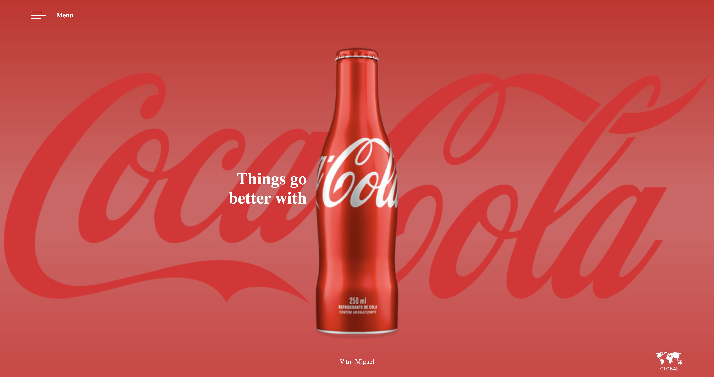

# COCA-COLA

Primeiro website criado, do tipo landing page, para treino no desenvolvimento de sites.
O site foi desenvolvido utilizando boas práticas, como por exemplo tags semânticas e responsividade.

# Dolly

Segundo website criado, do tipo landing page, para treino no desenvolvimento de sites.
O site foi desenvolvido utilizando boas práticas, como por exemplo tags semânticas e responsividade em grid.

## Tecnologias
* HTML
* CSS
* Media Queries

## Autor
[Vitor Miguel](https://www.linkedin.com/in/vitor-miguel-673806350/)